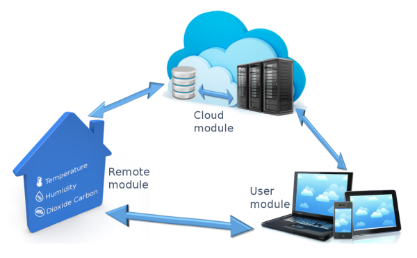

  

# Overview

Telegea is an open modular platform for thermal energy control and monitoring.  

It uses sensors and actuators to interact with the environment. It provides a single user interface which is able to handle different types and brands of thermal equipment, optimizes the comfort and increases the efficiency of heating/cooling systems. Based on the raw sensor data it calculates and visualuizes the actual thermal and electrical energy consumption.  

The platform is based on three main components:
* Remote device Telegea Smartbox for collecting data, remote control and performing automation tasks 
* Central Telegea server for data storage and processing 
* User interface for easy and intuitive access to the plants data and control 

  

The implementation of all components is strictly based on open source software and open protocols running on Linux OS. All modules are connected to each other via communication channels based on standard Internet protocols.  

The Remote device typically acquires data from temperature and humidity sensors, pulse counters and status signals and can control relays which  switch on or off loads and change the position of valves.  

The central server receives the data from the remote sites via the remote device, stores and processes the data and provides the web based graphical user interface. It presents the collected data in numerical and graphical format (charts) and allows the remote control of the thermal plant.  

The Telegea platform is designed to provide a system at low cost and which offers great flexibility. Cost is kept to a minimum by avoiding any additional hardware components and implement all functionality using only the components provided by the system board. Flexibility is achieved by providing the possibility of different combinations and configurations of the platforms main building blocks. This allows for a wide range of possible applications which goes far beyond the initial design goal to monitor thermal energy plants.  

