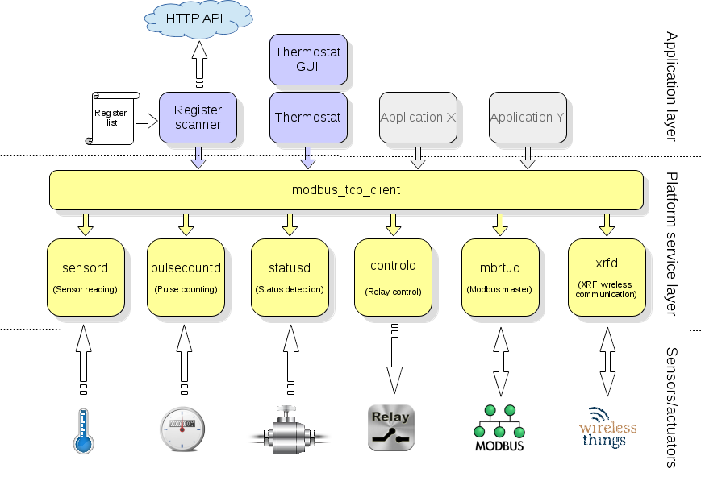

# Remote device software

The remote device is a Single Board Computer (RaspberryPi) which uses a modular and layered software architecture on top of the base operating system. The software modules are divided into the “Application layer” and the “Platform service layer”. The latter communicates with the physical sensors and actuators which permit interaction with the environment.  

The picture below shows an overview of the device software architecture.  
&nbsp;

## Operating system

The operating system is a minimal “just enough” installation of the Embedded Debian Linux distribution for ARM architecture (Raspbian) with a small footprint. It includes the Linux Kernel 4.x and several Linux user land utility programs. The user interface is console based, no graphical interface is needed for system administration and debugging. Support for GPIO sysfs and 1-wire thermal sensor sysfs interface is provided by the installed Kernel. This is needed by the custom modules described below.  

The Operating system comes built-in with the following functionalities which are configured and customized for the particular needs of the Telegea platform:  

* Remote debug and maintenance facilities
* Support for LAN, Wifi and GPRS remote connection
&nbsp;

## Platform service layer

Running on the base operating system, there are separate modules which handle sensor input and actuator output via wired and radio connections. Depending on the specific deployment scenario, single modules can be enabled/disabled as needed. All modules use generic standard Linux interfaces to access peripheral hardware and they are implemented in C code. This makes the software easily portable from one hardware platform to another.  

The service layer provides the following functionalities via its modules:  

* Sensor module for 1-wire temperature and DHT, SHT temperature/humidity sensors
* Pulse count module to count (low frequency) pulses from SO outputs
* Status module to report status on/off from external switches
* Control module to switch on/off relays and connected loads
* Modbus module to communicate with devices via Modbus RTU protocol
* XRF module to communicate with wireless devices using the XRF radio protocol
* Modbus TCP client to communicate with all above modules
&nbsp;

## Application layer

On top of the Platform service layer, applications are built to cater for specific needs and to automate interaction between sensors and actuators. Applications use the Modbus TCP client program to communicate with the modules from the service layer in order to read sensors, counters and control actuators.  

Applications are typically written in scripting languages like Bash and Python. The following applications a provided.  

* Register scanner for periodic reading and logging of selected sensor data
* Communication of sensor data to Telegea server via HTTP API and backup file
* Smart thermostat application and GUI

More applications can easily be added by taking advantage of the functionality provided by the  service layer modules.  
