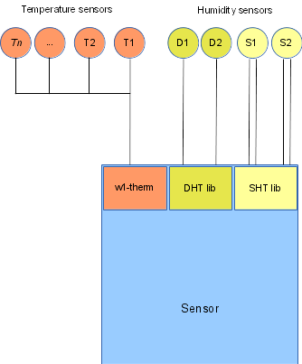

# Sensor module

## Description

The Sensor module handles the Dallas 1-wire digital temperature sensor, the single wire DHT22 humidity and temperature sensor and the 2-wire SHT21 humidity and temperature sensor.  

The 1-wire temperature sensors all share the same bus which connects to a predefined GPIO pin. The temperature values are provided via the w1-therm Kernel module and are accessed by the sensor module via sysfs files. Up to 10 sensors can be connected to the bus.  

The DHT22 sensor provides both relative humidity and temperature values via a single wire for each sensor. Up to two such sensors are supported. A single sensor can be connected via the SPI interface (MISO/MOSI lines) which is the recommended method since it is more robust. If multiple sensors are to be used they need to be connected to the GPIO lines (one pin for each sensor). The communication with this sensor type in implemented in the library dhtlib.  

The SHT21 sensor provides both relative humidity and temperature values via a two wire interface (I2C) for each sensor. Up to two such sensors are supported. A single sensor can be connected via the SPI interface (MISO/MOSI lines) which is the recommended method since it is more robust. If multiple sensors are to be used they need to be connected to the GPIO lines (one pin for each sensor). The communication with this sensor type in implemented in the library shtlib.  

The sensor values are provided in the Modbus registers via the built in Modbus TCP slave on request from the master.  
&nbsp;

&nbsp;

## Configuration

Configuration is done via command line parameters when the module executable is invoked.  

Syntax:  

    sensord <dht_pin1> <dht_pin2> <pow_pin> <sht_pin1> <sht_pin2>

The parameters `<dht_pin1>` and `<dht_pin2>` are the Kernel Ids of the GPIO pins where the data line of the DHT sensors are connected to. If the pin number 0 is specified, the module assumes that the humidity sensor is connected via the SPI interface (MISO line).  

Optionally another pin number can be specified with the -p option. The <pow_pin> parameter specifies the pin which will be used as power supply for the sensors instead of a fixed power line. In this way, the sensor will be automatically reset (by pulling the power to the sensor low for 1s) in case of three consecutive readings have failed. This is the only way to recover the sensor when it has completely locked up.  

The parameters `<sht_pin1>` and `<sht_pin2>` are the Kernel Ids of the GPIO pins where the data line of the SHT sensors are connected to. The Kernel Id for the corresponding clock line will be calculated incrementing this value by 1. If the pin number 0 is specified, the module assumes that the sensor is connected via the I2C interface.  

For a correct mapping of the the Dallas 1-wire temperature sensors to the modules Modbus registers, the sensor module needs the following symbolic links to the corresponding sysfs files to be defined.  

    /sensors/sensor1 → /sys/bus/w1/devices/28-<xxxxxxxxxxxx>/w1_slave
    /sensors/sensor2 → /sys/bus/w1/devices/28-<xxxxxxxxxxxx>/w1_slave
    …
    /sensors/sensor10 → /sys/bus/w1/devices/28-<xxxxxxxxxxxx>/w1_slave
    
Where `<xxxxxxxxxxxx>` is the specific code of each sensor.  
&nbsp;

## Modbus register map

#### Slave Address: 1

Register Address | Description | Unit | Type           | Divisor | Connection
-----------------|-------------|------|----------------|---------|-----------
1                |Temperature 1|  °C  |Signed int 16bit|   10    |1-wire bus
2                |Temperature 2|  °C  |Signed int 16bit|   10    |1-wire bus
3                |Temperature 3|  °C  |Signed int 16bit|   10    |1-wire bus
4                |Temperature 4|  °C  |Signed int 16bit|   10    |1-wire bus
5                |Temperature 5|  °C  |Signed int 16bit|   10    |1-wire bus
6                |Temperature 6|  °C  |Signed int 16bit|   10    |1-wire bus
7                |Temperature 7|  °C  |Signed int 16bit|   10    |1-wire bus
8                |Temperature 8|  °C  |Signed int 16bit|   10    |1-wire bus
9                |Temperature 9|  °C  |Signed int 16bit|   10    |1-wire bus
10               |Temperature 10|  °C  |Signed int 16bit|   10    |1-wire bus
11               |Humidity 1 DHT|  %   |Unsigned int 16bit| 10 | GPIO pin 1
12               |Temperature 11 DHT|°C|Signed int 16bit| 10 |
13               |Humidity 2 DHT|  %   |Unsigned int 16bit| 10 | GPIO pin 2
14               |Temperature 12 DHT|°C|Signed int 16bit| 10 |
15               |Humidity 3 SHT|  %   |Unsigned int 16bit| 10 | GPIO pin 3/4
16               |Temperature 13 SHT|°C|Signed int 16bit| 10 |
17               |Humidity 4 SHT|  %   |Unsigned int 16bit| 10 | GPIO pin 5/6
18               |Temperature 14 SHT|°C|Signed int 16bit| 10 |

