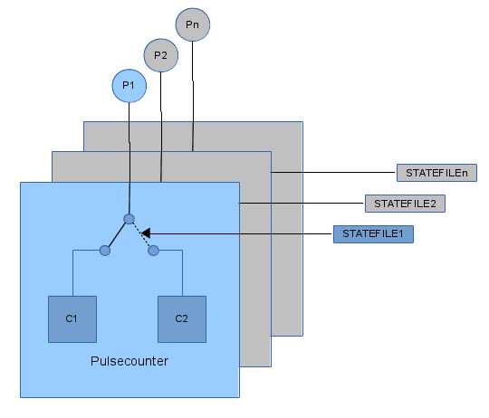

# Pulse counter module

## Description

The Pulse counter module provides 16 independent counters which count pulses detected on GPIO pins. Each pin can work in two different counting modes: single counter mode or virtual counters mode. This module is typically used to count pulses provided by flow or energy meters which measure some accumulating value. The frequency of the pulses needs to be low (a few Hz). No high frequency counting is supported with this software counter.  

Filtering is performed to discard false pulses and to make sure only pulses actually generated by the counter device are counted.  

In  *single counter* mode, edges on the associated GPIO pin are counted with a single counter.  

In *virtual counters* mode, the pulses on the associated GPIO pin are counted separately with two different exclusive counters, depending on an external status value. The state of the external input selects which of the two counters is incremented when an edge is detected. The external state value is provided as content of a simple file. Possible values are 0 (unknown state), 1 and 2.  

The updated counter values are provided both via output files in tmpfs and in Modbus registers  via the built in Modbus TCP slave.  
&nbsp;

&nbsp;

## Configuration

Configuration is done via command line parameters when the module executable is invoked.  

Syntax:  

    pulsecountd <pin1> <div1> [<statefile1>] \
               [<pin2> <div2> [<statefile2>] … \ 
               [<pin8> <div8> [<statefile8>]]]

The `<pin>` parameters are the Kernel Ids of the GPIO pins which will be used to count edges on. At least one GPIO pin needs to be specified. A pin number of 0 means that this pin is not used.  

The `
` parameter is the divisor which will be applied to the counter value to be able to adapt to different counter devices. Both integer or fractional values are accepted.  

If the optional `<statefile>` name is not provided together with a pin to count on, the counter will work in single counter mode, otherwise it works in virtual counters mode.  

Up to 8 GPIO pin Ids for 8 physical counters can be provided.  
&nbsp;

## Output files

An output file for every counter is provided which contains always the updated counter value. The path and filename are created according to the following format:  

For single counters:
    /tmp/pulsecount<pinId>

For virtual counters:
    /tmp/pulsecount<pinId>_1
    /tmp/pulsecount<pinId>_2

where `<pinId>` is the Kernel ID of the GPIO pin associated to the counter.  
&nbsp;

## Modbus register map

#### Slave Address: 2

Register Address | Description | Unit | Type           | Divisor | Connection
-----------------|-------------|------|----------------|---------|-----------
1                |Counter 1_1  r/v|TBD|Unsigned int 16bit|TBD|TODO
2                |Counter 1_2  v|TBD|Unsigned int 16bit|TBD|TODO
3                |Counter 2_1  r/v|TBD|Unsigned int 16bit|TBD|TODO
4                |Counter 2_2  v|TBD|Unsigned int 16bit|TBD|TODO
5                |Counter 3_1  r/v|TBD|Unsigned int 16bit|TBD|TODO
6                |Counter 3_2  v|TBD|Unsigned int 16bit|TBD|TODO
7                |Counter 4_1  r/v|TBD|Unsigned int 16bit|TBD|TODO
8                |Counter 4_2  v|TBD|Unsigned int 16bit|TBD|TODO
9                |Counter 5_1  r/v|TBD|Unsigned int 16bit|TBD|TODO
10               |Counter 5_2  v|TBD|Unsigned int 16bit|TBD|TODO
11               |Counter 6_1  r/v|TBD|Unsigned int 16bit|TBD|TODO
12               |Counter 6_2  v|TBD|Unsigned int 16bit|TBD|TODO
13               |Counter 7_1  r/v|TBD|Unsigned int 16bit|TBD|TODO
14               |Counter 7_2  v|TBD|Unsigned int 16bit|TBD|TODO
15               |Counter 8_1  r/v|TBD|Unsigned int 16bit|TBD|TODO
16               |Counter 8_2  v|TBD|Unsigned int 16bit|TBD|TODO

* *Counter X_1 r/v* is the real counter in single counter mode or the first of the virtual counters in  dual virtual counters mode
* *Counter X_2 v* is the second of the virtual counters in dual virtual counters mode (not used in single counter mode)

