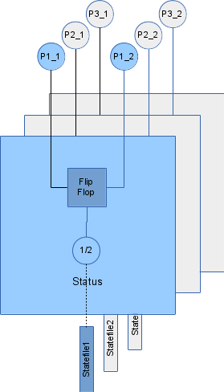

# Status module

## Description

The Status module implements a number of software Flip Flops. It monitors a single or a pair of two digital inputs from the GPIO lines and saves the last active state as output. The logic value which is considered active can be configured as active high or active low.  

When using a pair of two inputs, the typical purpose of this module is to provide the status or position of a valve which provides two state signals (fully open / fully closed) and is controlled by an external device. The module will report the current position . Another possible use is to monitor two alternative pulse signals (from e.g. two flow meters). In this case, the last active input will be reported which gives an information about where the liquid is flowing.  

When monitoring a single data line, the current active state will be reported. This is typically used for alarm conditions or valves with just a single state signal.  

Before one of the state signals becomes active for the first time, the state/position is unknown.  

Multiple one single or one pair of input signals is supported.  

The updated status values are provided both via an output file in tmpfs and in Modbus registers via the built in Modbus TCP slave. The output state files of this module can be used as input state files for the Pulsecounter module to handle virtual counters.  
&nbsp;

  
&nbsp;

## Configuration

Configuration is done via command line parameters when the module executable is invoked.  

Syntax:  

    statusd <pin1_1> <pin1_2> [-n] [<pin2_1> <pin2_2> [-n]]

The two `<pinx_1>` and `<pinx_2>` parameters are the Kernel Ids of the GPIO pins which will be used as status inputs from the external appliance. If `<pinx_2>` is zero, single input mode will be used. If the optional `-n` parameter is specified, active low logic will be applied, active high otherwise (default).  
&nbsp;

## Output files
An output file is provided which contains always the current status.  

    /tmp/state_<pinx_1>.<pinx_2>

Possible state values:  

0 - unkown state  
1 - last active input was input 1 (or ON in single input mode)  
2 - last active input was input 2 (or OFF in single input mode)  
&nbsp;

## Modbus register map

#### Slave Address: 3

Register Address | Description | Unit | Type           | Divisor | Connection
-----------------|-------------|------|----------------|---------|-----------
1                |Flipflop1 state |NA|Unsigned int 16bit|NA|TODO
2                |Flipflop2 state |NA|Unsigned int 16bit|NA|TODO
3                |Flipflop3 state |NA|Unsigned int 16bit|NA|TODO
4                |Flipflop4 state |NA|Unsigned int 16bit|NA|TODO
5                |Flipflop5 state |NA|Unsigned int 16bit|NA|TODO
6                |Flipflop6 state |NA|Unsigned int 16bit|NA|TODO
7                |Flipflop7 state |NA|Unsigned int 16bit|NA|TODO
8                |Flipflop8 state |NA|Unsigned int 16bit|NA|TODO
9                |Flipflop9 state |NA|Unsigned int 16bit|NA|TODO
10               |Flipflop10 state |NA|Unsigned int 16bit|NA|TODO
11               |Flipflop11 state |NA|Unsigned int 16bit|NA|TODO
12               |Flipflop12 state |NA|Unsigned int 16bit|NA|TODO
13               |Flipflop13 state |NA|Unsigned int 16bit|NA|TODO
14               |Flipflop14 state |NA|Unsigned int 16bit|NA|TODO
15               |Flipflop15 state |NA|Unsigned int 16bit|NA|TODO
16               |Flipflop16 state |NA|Unsigned int 16bit|NA|TODO
