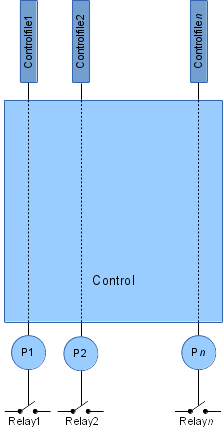

# Control module

## Description

The Control module controls digital outputs via GPIO pins which typically switch on or off external relays which then can open/close valves or start/stop a motor. In addition to a simple on/off switch, also a short pulse can be generated on the selected output.  

The controlling input can be achieved both by writing to the configured control files and to the Modbus registers via the built in Modbus TCP slave. The current values can also be read via these methods.  

On startup, output values stored in the control files are restored by applying them to the physical GPIO lines.  
&nbsp;

  
&nbsp;

## Configuration

Configuration is done via command line parameters when the module executable is invoked.  

Syntax:  

    statusd <pin1> <ctrl_file1> [<pin2> <ctrl_file2> … [<pinN> <ctrl_fileN>]]

The `<pin>` parameters are the Kernel Ids of the GPIO pins which will be used as outputs to control the connected relays. The `<ctrl_file>` parameters are file names which are used to control the outputs. At least one pair of `<pin>` and `<ctrl_file>` needs to be provided.  
&nbsp;

## Input files

Any existing filename either in tmpfs or on disk/flash drive can be specified as input control file.  

Possible values which can be written to the control file:  

1 - switch output on  
2 - switch output off  
3 - generate low pulse  
4 - generate high pulse  
&nbsp;

## Modbus register map

#### Slave Address: 4

Register Address | Description | Unit | Type           | Divisor | Connection
-----------------|-------------|------|----------------|---------|-----------
1                |Output 1     |NA|Unsigned int 16bit|NA|TODO
2                |Output 2     |NA|Unsigned int 16bit|NA|TODO
3                |Output 3     |NA|Unsigned int 16bit|NA|TODO
4                |Output 4     |NA|Unsigned int 16bit|NA|TODO
5                |Output 5     |NA|Unsigned int 16bit|NA|TODO
6                |Output 6     |NA|Unsigned int 16bit|NA|TODO
7                |Output 7     |NA|Unsigned int 16bit|NA|TODO
8                |Output 8     |NA|Unsigned int 16bit|NA|TODO
