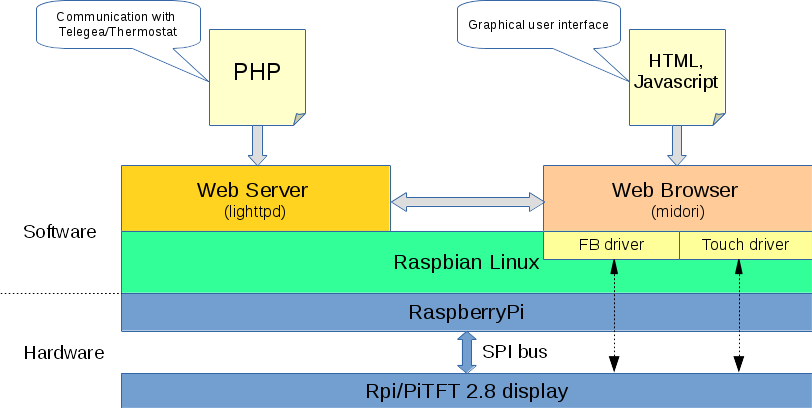
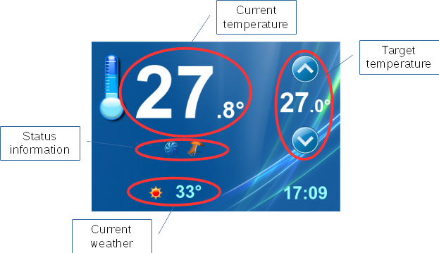

# Thermostat GUI module

## Description

This module implements a graphical user interface for the thermostat module.  

The user interface is provided on a small TFT display which is supported by the [fbtft kernel driver](https://github.com/notro/fbtft).  It is implemented as a web page which is diplayed by a local web browser (Midori) in full screen mode. The communication with the thermostat module which provides the data to be displayed is handled by a seperate PHP file, accessed from the web page through the local web server (lighttpd).  

Alternatively to the local web browser, the user interface can also be displayed on any external web browser, e.g. on a separate Smartbox or a PC or Smartphone, as long as these have access to the thermostats web server.  

#### Overview

See the following picture for an architectural overview.  
&nbsp;

  
&nbsp;
  

#### User interface

The user interface provides the possibility to display the current room temperature as well as the outside temperature and the weather conditions. The latter are retrieved from the Internet and don't need a local sensor. The interface also displays the selected target temperature and allows to modify it via "up" and "down" buttons.  
&nbsp;

  
&nbsp;

## Configuration

The parameters needed by the Thermostat GUI are read from the global Telegea config file.  

Parameter |Description
----------|-----------
thermostat_device_ip | IP address of the thermostat device
plantid   | Plant ID
location  | Geographic localtion (for weather data)
apiurl    | URL of Telegea HTTP API
apikey    | HTTP API key for authorization
control1  | name of heat/cool control register 1
control2  | name of heat/cool control register 2
user_mode | user mode (smart/dumb)
