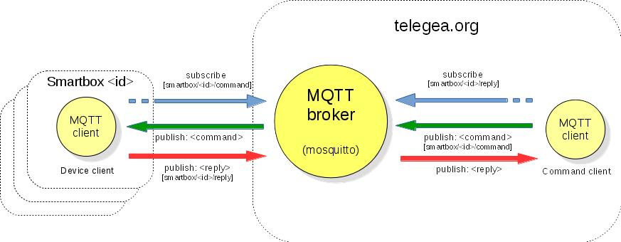

# MQTT client module

## Description

This module implements an MQTT client which receives commands from the Telegea server.  

Commands are typically requests to query a sensor module to read a temperature or humidity value, or to switch on or off an actuator with the control module. But also other types of commands requesting more generic services can be handled. The Smartbox could be requested to start a software update, or to perform a system restart.

With the MQTT protocol it is easy to establish a permanent connection from the Smartbox, which is typically located in a private LAN, to the Telegea server on the Internet. A client running on the server side is then able to publish commands to the Smartbox using this connection. No specific configuration of the private networks gateway router is necessary. This also works behind firewalls or NAT as long as outgoing traffic from the private LAN is allowed.  

When a command is received by the MQTT client, it will be executed and a response is published to the server side client.  

#### Overview

See the following picture for an architectural overview and the subscribe/publish methods.  
&nbsp;

  
&nbsp;
  

#### Publish/subcribe mechanism, topics

The following sequences describe the procedure the client performs to subscribe to certain topics and to publish data on others.  

##### Initialization  
* the client connects to the broker and registers the will "I'm dead" at topic `smartbox/<id>/deadoralive`
* the client subscribes to command messages at topic `smartbox/<id>/command`
* the client publishes "I'm alive" message on topic `smartbox/<id>/deadoralive`
* the client waits for commands  
  
##### Client Loop
* the client receives a command from server
* the client performs the command
* the client publishes the commands reply on topic `smartbox/<id>/reply`  

#### Command types

The MQTT client handles different type of commands. Every command has its specific syntax.

Command type   | Format | Description
---------------|--------|------------
Modbus request | `1 <modAddr> <regAddr> [<regVal>]` | Request to query a module via ModbusTCP client
Service command| `2 <srvCmd>`                       | Request a service e.g. SW update
Future use     | `3`                                | TBD

## Configuration

The parameters needed by the MQTT client are read from the global Telegea config file.  

Parameter |Description
----------|-----------
plantId   | Plant ID
extCmd    | ModbusTCP master command
ipAddr    | ModbusTCP slave IP address
